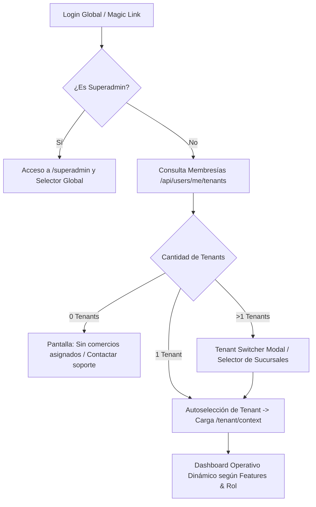

# 🏢 Especificación y Flujo: Gestión de Usuarios y Tenants (Frontend)
### Aurea Backoffice Frontend · `backoffice-fe-aurea`

Este documento detalla el comportamiento, los flujos de experiencia de usuario (UX), la arquitectura de estado, los componentes visuales y las reglas de negocio que el Frontend del Backoffice implementa para la **Gestión de Usuarios y Tenants**.

---

## 1. Visión General del Modelo de Tenancy en Frontend

El Backoffice de Aurea es una **Single Page Application / PWA multi-tenant**, lo que significa que una única aplicación atiende tanto la administración global de la plataforma (SuperAdmin) como la operación diaria de múltiples comercios y sus equipos de trabajo.

### Principios Fundamentales en la UI:
1. **Identidad Global Única:** El usuario inicia sesión una sola vez con sus credenciales globales (`User`).
2. **Contexto Activo de Tenant:** Una vez autenticado, el usuario opera bajo el contexto de un comercio seleccionado (`activeTenant`). Todas las peticiones HTTP subsiguientes inyectan automáticamente la cabecera `x-tenant-id`.
3. **Validación Tridimensional de UI (Tenant + Feature + Rol):**
   - **Tenant Activo:** Si el comercio está suspendido, se bloquea el acceso con una pantalla informativa.
   - **Feature Habilitada (FBAC):** Los módulos no contratados (ej. `bookings`, `delivery`, `tables`) no se renderizan en el menú lateral ni en las rutas.
   - **Permisos del Rol (RBAC):** Las acciones restringidas (como invitar usuarios, cambiar branding o tocar facturación) se ocultan o deshabilitan según el rol del usuario (`OWNER`, `MANAGER`, `STAFF`, `CASHIER`).

---

## 2. Flujo de Experiencia de Usuario (UX Step-by-Step)



### Paso 1: Autenticación y Carga Inicial
- El usuario ingresa credenciales o solicita un Magic Link en `/login`.
- Al recibir el JWT y el perfil de usuario:
  - `authStore.setAuth(user, token)` almacena la sesión.
  - Si `user.role === 'SUPERADMIN'`, se habilita el acceso a la sección de administración global `/superadmin`.
  - El frontend solicita las membresías activas del usuario: `GET /users/me/tenants`.

### Paso 2: Selección y Resolución del Comercio (Tenant Switcher)
- **1 solo comercio:** Se fija automáticamente como `activeTenant` en `tenantStore` y se redirige a `/dashboard`.
- **Múltiples comercios (ej. franquiciado o dueño de varios locales):** Se presenta el **Tenant Switcher** (`components/common/TenantSwitcher.tsx`) en el Topbar y en pantalla inicial para seleccionar el establecimiento a gestionar.
- Al conmutar de comercio:
  - Se actualiza `activeTenantId` en `localStorage`.
  - Se invalida la caché de React Query / Axios.
  - Se consulta `GET /tenant/context` para obtener las Features activas (`TenantFeature[]`) y los permisos del usuario en ese local específico.
  - Se recalculan las opciones visibles del Sidebar.

---

## 3. Módulos y Pantallas de Gestión

### 👑 A. Panel SuperAdmin (`/superadmin`)
*Exclusivo para usuarios con rol `SUPERADMIN` de Aurea.*

#### 1. Directorio Global de Tenants (`/superadmin/tenants` · `SuperadminTenantsPage.tsx`)
- **Visualización:** Tabla / Tarjetas con búsqueda en tiempo real, filtros por vertical (`gastronomía`, `belleza`, `salud`, etc.) y estado (`activo`/`inactivo`).
- **Alta de Nuevo Tenant (Modal Onboarding):**
  - Nombre comercial y generación automática o manual de `slug` único (ej. `pizzeria-napoles`).
  - Vertical / Rubro informativo.
  - Asignación de correo electrónico del Owner inicial (crea la membresía `OWNER` automáticamente).
  - Selección del paquete de Features iniciales.
- **Acciones Rápidas:**
  - Alternar estado (Activar / Suspender comercio).
  - Editar configuración y datos fiscales.
  - Acceso directo a la gestión de Features del tenant.

#### 2. Matriz de Feature Flags por Tenant (`/superadmin/features` · `SuperadminFeaturesPage.tsx`)
- Permite activar o desactivar módulos en caliente para cualquier comercio:
  - `bookings` (Gestión de turnos y agendas).
  - `catalog` (Catálogo de productos y servicios).
  - `delivery` (Pedidos online y delivery / take away).
  - `tables` (Comandas y salones para gastronomía).
  - `reviews` (Muro de reseñas y testimonios).
- La activación/desactivación impacta inmediatamente en el portal público del cliente y en el menú del Backoffice del comercio.

---

### 👥 B. Gestión de Equipo y Colaboradores (`/members` · `MembersPage.tsx`)
*Disponible para `OWNER` y `MANAGER` dentro del comercio activo.*

#### 1. Listado de Colaboradores del Tenant
- Tarjetas o tabla con:
  - Avatar, Nombre completo y Correo electrónico.
  - Badge de Rol: `OWNER` (Violeta), `MANAGER` (Azul), `STAFF` (Verde), `CASHIER` (Ámbar).
  - Estado de la membresía (`Activo`, `Invitación Pendiente`, `Desactivado`).
  - Fecha de incorporación.

#### 2. Invitación de Nuevos Miembros (`InviteMemberDialog.tsx`)
- Formulario modal:
  - Correo electrónico del colaborador.
  - Selección del Rol a asignar (`MANAGER`, `STAFF`, `CASHIER`).
  - Generación de invitación: envía correo con enlace mágico o genera un código de un solo uso.
- Si el usuario ya existe en Aurea, se vincula inmediatamente al tenant. Si no existe, se le guía por el onboarding de registro.

#### 3. Control de Permisos y Acciones de Miembro
- **Cambio de Rol:** El `OWNER` puede promover o degradar colaboradores.
- **Suspender / Reactivar:** Bloquea temporalmente el acceso del colaborador al tenant sin eliminar su historial.
- **Expulsar del Comercio:** Elimina el registro `TenantUser`. (Protección: el último `OWNER` no puede ser eliminado).

---

### ⚙️ C. Configuración del Tenant (`/settings` · `SettingsPage.tsx`)
*Disponible para `OWNER` y `MANAGER`.*

- **Identidad & Branding:** Nombre público, slug/subdominio, logotipo, color primario y banner.
- **Canales de Contacto:** Teléfono, enlace directo a WhatsApp con mensaje predeterminado, dirección física y enlaces a redes sociales (Instagram, TikTok, Web).
- **Horarios y Disponibilidad:** Configuración de franjas horarias semanales para atención al público y turnos.

---

## 4. Arquitectura de Estado y Peticiones (Frontend)

### Stores Zustand
1. **`authStore` (`src/store/authStore.ts`):**
   - `user`: Datos del usuario autenticado (`id`, `email`, `name`, `isSuperAdmin`).
   - `token`: JWT global.
   - `isAuthenticated`: Boolean.
2. **`tenantStore` (`src/store/tenantStore.ts`):**
   - `activeTenant`: Objeto con `id`, `name`, `slug`, `vertical`, `features`, `userRole`.
   - `userTenants`: Array de comercios donde el usuario tiene membresía.
   - `setActiveTenant(tenant)`: Cambia el contexto y persiste en `localStorage`.

### Interceptor HTTP de Axios (`src/api/axiosClient.ts`)
```typescript
// Todas las peticiones inyectan automáticamente el Tenant y el JWT
axiosClient.interceptors.request.use((config) => {
  const token = useAuthStore.getState().token;
  const activeTenant = useTenantStore.getState().activeTenant;

  if (token) {
    config.headers.Authorization = `Bearer ${token}`;
  }
  if (activeTenant?.id) {
    config.headers['x-tenant-id'] = activeTenant.id;
  }
  return config;
});
```

---

## 5. Matriz de Permisos en Vistas (RBAC Frontend)

| Vista / Acción | SuperAdmin | Owner | Manager | Staff | Cashier |
| :--- | :---: | :---: | :---: | :---: | :---: |
| Panel Global SuperAdmin (`/superadmin/*`) | ✅ | ❌ | ❌ | ❌ | ❌ |
| Alta y Suspensión de Comercios | ✅ | ❌ | ❌ | ❌ | ❌ |
| Modificar Feature Flags del Tenant | ✅ | ❌ | ❌ | ❌ | ❌ |
| Switcher entre Comercios propios | ✅ | ✅ | ✅ | ✅ | ✅ |
| Invitar Colaboradores al Comercio | ❌ | ✅ | ✅ | ❌ | ❌ |
| Cambiar Rol / Expulsar Miembros | ❌ | ✅ | ❌ | ❌ | ❌ |
| Configuración de Branding y Negocio | ❌ | ✅ | ✅ | ❌ | ❌ |
| Gestión de Catálogo y Servicios | ❌ | ✅ | ✅ | ❌ | ❌ |
| Ver Agenda de Turnos / Pedidos | ❌ | ✅ | ✅ | ✅ | ✅ |
| Procesar Cobros y Caja | ❌ | ✅ | ✅ | ❌ | ✅ |
